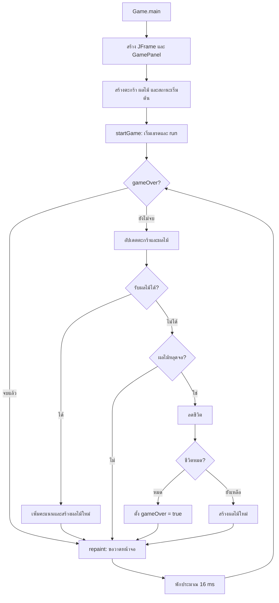

# Fruit Catcher

เกมรับผลไม้ที่เขียนด้วย Java Swing ผู้เล่นใช้ปุ่มลูกศรซ้ายและขวาเลื่อนตะกร้า รับผลไม้ได้ครั้งละ 1 คะแนน หากรับไม่ทันจะเสีย 1 ชีวิต โดยโค้ดปัจจุบันเริ่มต้นที่ 30 ชีวิต

## วิธีรัน

ติดตั้ง JDK แล้วรันคำสั่งต่อไปนี้จากโฟลเดอร์โปรเจกต์

```sh
javac -encoding UTF-8 -d out src/oop/game/*.java
java -cp out oop.game.Game
```

## Life Cycle ของเกม

Life Cycle คือวงจรการทำงานตั้งแต่เริ่มโปรแกรม สร้างสิ่งที่เกมต้องใช้ เล่นเกม จนถึงปิดโปรแกรม โดยมีคลาสหลักดังนี้

| คลาส        | หน้าที่                                                      |
| ----------- | ------------------------------------------------------------ |
| `Game`      | จุดเริ่มต้นของโปรแกรม สร้างและแสดงหน้าต่าง                   |
| `GamePanel` | เก็บสถานะเกม รับปุ่ม ควบคุม Game Loop ตรวจการชน และวาดหน้าจอ |
| `Basket`    | เก็บตำแหน่งและสถานะการเคลื่อนที่ของตะกร้า                    |
| `Fruit`     | สุ่มตำแหน่งเริ่มต้น อัปเดตการตก และวาดผลไม้                  |

### 1. เริ่มโปรแกรม — `Game.main()`

เมื่อรัน `oop.game.Game` Java จะเรียก `main()` เพื่อสร้าง `JFrame` ชื่อ Fruit Catcher กำหนดให้ปิดโปรแกรมเมื่อกด X และไม่ให้ปรับขนาดหน้าต่าง

จากนั้นสร้าง `GamePanel` ใส่ลงในหน้าต่าง เรียก `pack()` เพื่อปรับขนาดให้พอดี จัดหน้าต่างให้อยู่กลางจอ และเรียก `setVisible(true)` เพื่อแสดงเกม

### 2. เตรียมเกม — Constructor ของ `GamePanel`

การเรียก `new GamePanel()` จะทำงานตามลำดับนี้

1. กำหนดพื้นที่เล่นขนาด 400 × 600 พิกเซล และพื้นหลังสีขาว
2. อนุญาตให้ Panel รับ Keyboard Focus และลงทะเบียน `KeyListener`
3. สร้าง `Basket` ไว้กลางหน้าจอบริเวณด้านล่าง
4. สร้าง `Fruit` โดยสุ่มค่า `x` และตั้ง `y = -30` ให้เริ่มเหนือขอบจอ
5. ตั้งค่า `score = 0`, `life = 30` และ `gameOver = false`
6. เรียก `startGame()` เพื่อเริ่ม Game Loop

ดังนั้น Game Loop เริ่มจาก Constructor ก่อนที่ `Game.main()` จะเรียกแสดงหน้าต่างเสร็จ

### 3. เริ่ม Game Loop — `startGame()` → `run()`

`startGame()` ตั้ง `running = true` แล้วสร้าง `new Thread(this)` เนื่องจาก `GamePanel` implements `Runnable` เมื่อเรียก `gameThread.start()` เธรดใหม่จึงเริ่มทำงานที่ `run()`

ภายใน `run()` จะวนซ้ำตราบใดที่ `running` ยังเป็น `true`

```text
gameUpdate()       อัปเดตข้อมูลเกม
      ↓
repaint()          ขอให้ Swing วาดหน้าจอใหม่
      ↓
Thread.sleep(16)   พักประมาณ 16 มิลลิวินาที
      ↓
วนกลับรอบถัดไป
```

การพัก 16 มิลลิวินาทีทำให้เกมทำงานใกล้เคียง 60 รอบต่อวินาที แต่ไม่ได้รับประกัน 60 FPS เพราะแต่ละรอบยังใช้เวลาประมวลผล และ Swing จัดการวาดภาพแยกจากเธรดเกม

### 4. รับคำสั่งจากผู้เล่น — `keyPressed()` / `keyReleased()`

เมื่อ Panel มี Keyboard Focus การกดลูกศรซ้ายหรือขวาจะตั้งค่า `left` หรือ `right` ของตะกร้าเป็น `true` เมื่อปล่อยปุ่มจะตั้งกลับเป็น `false`

เมธอดรับปุ่มไม่ได้เปลี่ยนตำแหน่งตะกร้าโดยตรง แต่ `Basket.update()` จะอ่านสถานะเหล่านี้ในแต่ละรอบของ Game Loop จึงเลื่อนต่อเนื่องได้เมื่อกดปุ่มค้างไว้

```text
กดลูกศรขวา → setRight(true)
                    ↓
แต่ละรอบ: basket.update() → x เพิ่ม 5 พิกเซล
                    ↓
ปล่อยลูกศรขวา → setRight(false) → หยุดเคลื่อนที่ไปทางขวา
```

### 5. อัปเดตสถานะ — `gameUpdate()`

แต่ละรอบจะตรวจและทำงานตามลำดับดังนี้

1. **ตรวจว่าเกมจบหรือยัง** — ถ้า `gameOver` เป็น `true` จะ `return` ทันที ทำให้ตำแหน่ง คะแนน และชีวิตไม่เปลี่ยนต่อ
2. **เลื่อนตะกร้า** — `basket.update()` เลื่อนซ้ายหรือขวาครั้งละ 5 พิกเซลตามสถานะปุ่ม และจำกัดตำแหน่งไม่ให้ออกนอกจอ
3. **เลื่อนผลไม้** — `fruit.update()` เพิ่มค่า `y` ครั้งละ 3 พิกเซล ทำให้ผลไม้ตกลงมา
4. **ตรวจการรับผลไม้** — ใช้ `getBounds().intersects(...)` ตรวจว่ากรอบสี่เหลี่ยมของผลไม้และตะกร้าซ้อนกันหรือไม่ หากชนกันจะเพิ่มคะแนน พิมพ์คะแนนใน Terminal สร้างผลไม้ลูกใหม่ และ `return` เพื่อจบรอบอัปเดตนี้
5. **ตรวจผลไม้หลุดจอ** — ถ้า `fruit.isOutOfScreen()` พบว่า `y > 600` จะลดชีวิตและพิมพ์ชีวิตที่เหลือใน Terminal หากยังมีชีวิตจะสร้างผลไม้ลูกใหม่ แต่ถ้าชีวิตหมดจะตั้ง `gameOver = true`

เกมมีผลไม้ที่กำลังเล่นครั้งละหนึ่งลูก ทุกครั้งที่ใช้ `fruit = new Fruit()` ตัวแปรจะอ้างอิงลูกใหม่ซึ่งเริ่มตกจากด้านบนอีกครั้ง ส่วนลูกเก่าที่ไม่มีผู้ใช้อ้างอิงแล้วจะสามารถถูก Garbage Collector เก็บคืนหน่วยความจำในภายหลัง

### 6. วาดหน้าจอ — `repaint()` → `paintComponent()`

`repaint()` เป็นการส่งคำขอวาดใหม่ให้ Swing ไม่ได้เรียก `paintComponent()` ให้เสร็จทันทีในเธรดเกม โดย Swing จะจัดการเรียกเมธอดวาดบน Event Dispatch Thread (EDT) ซึ่งเป็นเธรดที่จัดการเหตุการณ์ UI รวมถึงการกดปุ่ม

ภายใน `paintComponent(Graphics g)` จะทำงานดังนี้

1. เรียก `super.paintComponent(g)` เพื่อล้างภาพเดิมและวาดพื้นหลัง
2. วาดชื่อเกม คะแนน และชีวิต
3. เรียก `basket.render(g)` เพื่อวาดตะกร้าสีส้ม
4. เรียก `fruit.render(g)` เพื่อวาดผลไม้สีแดง
5. หาก `gameOver` เป็น `true` จะวาดข้อความ `GAME OVER` และคะแนนด้วย

การอัปเดตเปลี่ยน **ข้อมูล** เช่น `x`, `y`, `score` ส่วนการวาดนำข้อมูลนั้นมาแสดงเป็น **ภาพ** โดย Swing อาจรวมคำขอวาดหลายครั้งเข้าด้วยกัน จึงไม่จำเป็นต้องวาดหนึ่งครั้งต่อหนึ่งรอบอัปเดตเสมอไป

### 7. เกมจบและปิดโปรแกรม

เมื่อชีวิตเหลือ 0 จะตั้ง `gameOver = true` ทำให้ `gameUpdate()` ไม่อัปเดตเกมต่อ แต่ `running` ยังเป็น `true` ดังนั้น Game Loop ยังคงเรียก `repaint()` และพัก 16 มิลลิวินาทีต่อไป หน้าจอจึงยังแสดงสถานะเกมจบอยู่

โค้ดปัจจุบันยังไม่มีปุ่มเริ่มใหม่ หากต้องการเล่นใหม่ต้องปิดแล้วรันโปรแกรมอีกครั้ง เมื่อกด X การตั้งค่า `JFrame.EXIT_ON_CLOSE` จะทำให้โปรแกรมสิ้นสุด ส่วนกรณีเธรดถูก interrupt ระหว่าง `sleep()` โค้ดใน `catch` จะตั้ง `running = false` เพื่อให้จบลูป



แผนภาพแสดงลูปขณะที่ `running = true` ผู้เล่นปิดหน้าต่างเพื่อจบโปรแกรมได้ทุกช่วง

### ข้อสังเกตจากโค้ดปัจจุบัน

ใน `paintComponent()` มีทั้งการวาด `"Life: " + life` และข้อความคงที่ `"Life: 3"` ที่ตำแหน่งเดียวกัน ทำให้ข้อความซ้อนกันได้ จำนวนชีวิตที่ใช้คำนวณจริงเริ่มต้นที่ **30** ตามตัวแปร `life` ใน Constructor

javac -encoding UTF-8 -d out src/oop/game/\*.java
java -cp out oop.game.Game
